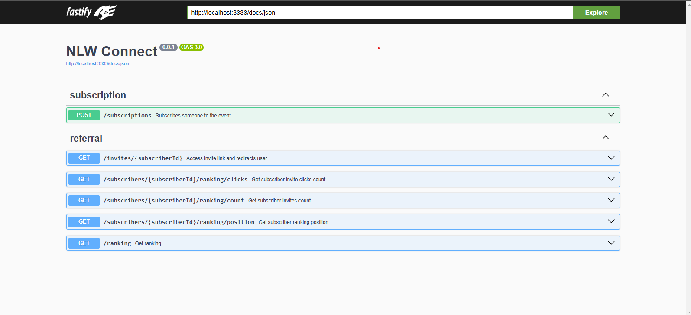

# NLW CONNECT - NODE JS

Este é um projeto backend realizado no evento da nlw da rocketseat. Ele consiste em um backend de sistema de rotas com diversas ferramentas almejadas no mercado de trabalho.

## Tecnologias

- Fastify
- Postgres
- Redis
- zod
- Swagger UI do fastify
- drizze
- docker
- biome.json

## Containers

O projeto utiliza Docker Compose para orquestrar múltiplos containers de desenvolvimento.
Ao todo, foram utilizados 2 containers, sendo eles:

- service-pg: serviço do banco de dados postgres
- service-redis: é um banco de dados NoSQL em memória, de código aberto, usado para cache, filas, pub/sub e armazenamento de dados de alta performance

## Backend

O backend é uma api RESTful feita em fastify, utilizando o drizze de ORM para fazer as consultas no banco de dados

## Banco de dados

O banco de dados utilizado é o postgresql, um banco relacional.

O banco consiste em apenas uma tabela:

#### subscriptions

| id   | name | email | created_at |
| ---- | ---- | ----- | ---------- |
| UUID | Text | Text  | Timestamp  |

- id: identificador único da tarefa
- name: nome do usuário
- email: email do usuário
- created_at: data e hora da criação

## Documentação

A partir do momento que você rodar o backend, acesse a seguinte url para visualizar o endPoint:
http://localhost:3333/docs



Executando o projeto

### Pré-requisitos

⚠️ Para executar o projeto, é necessário:

- Ter o Docker instalados na sua máquina.
- Clonar o este repositório.
- Criar um arquivo .env na raiz do projeto, com base no .env.example, definindo os valores de cada variável de ambiente usada.

## Passo a passo

Com os pré-requisitos atendidos, siga os seguintes passos para executar o projeto:

1. Na raiz do projeto, execute o seguinte comando para iniciar os containers da aplicação:

```cmd
docker-compose up -d
```

2.Logos em seguida, execute o seguinte comando

```cmd
npm run dev
```

Com os containers e servidor inicializados, acesse o seguinte endereço no navegador para ver a aplicação rodando:

```
localhost:3333/docs
```
